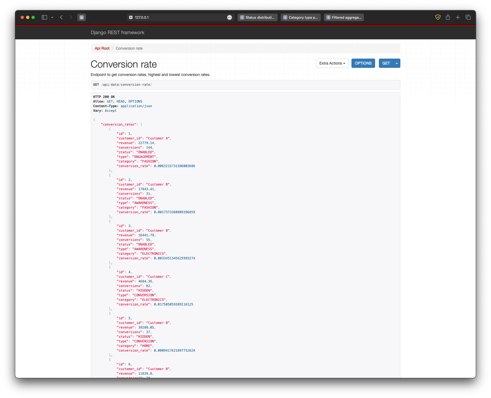
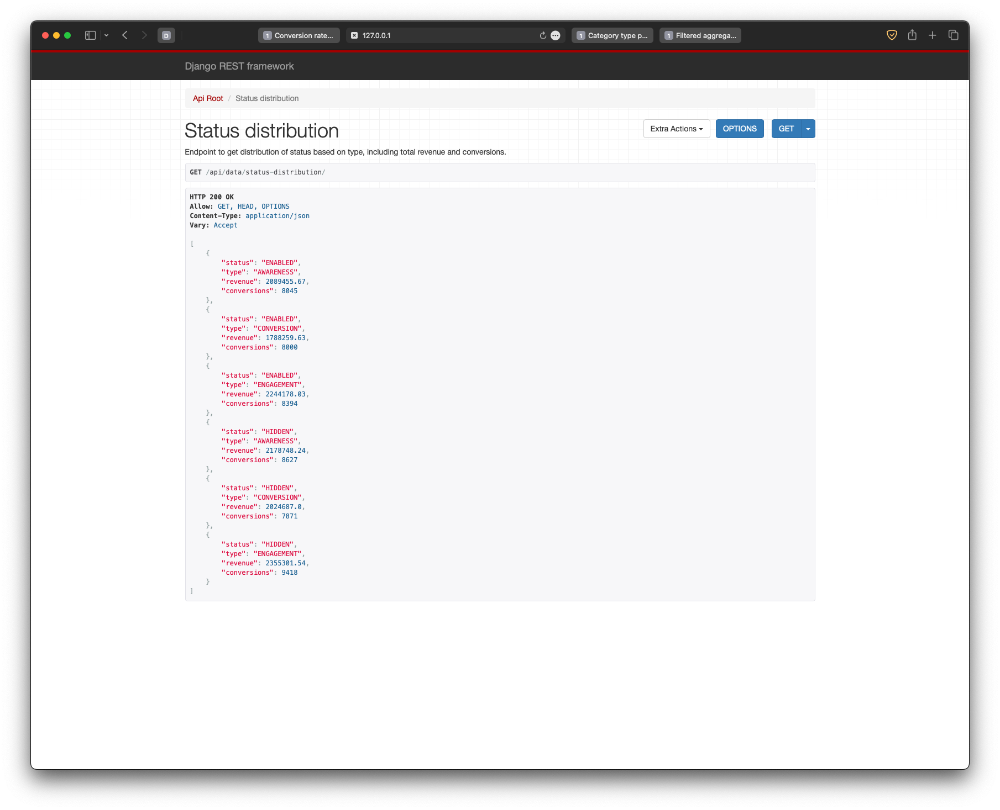
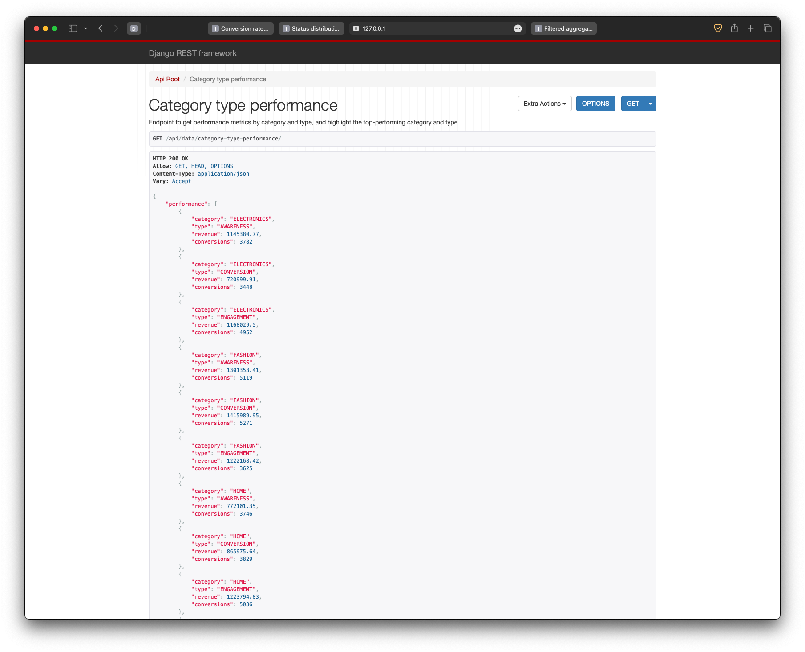
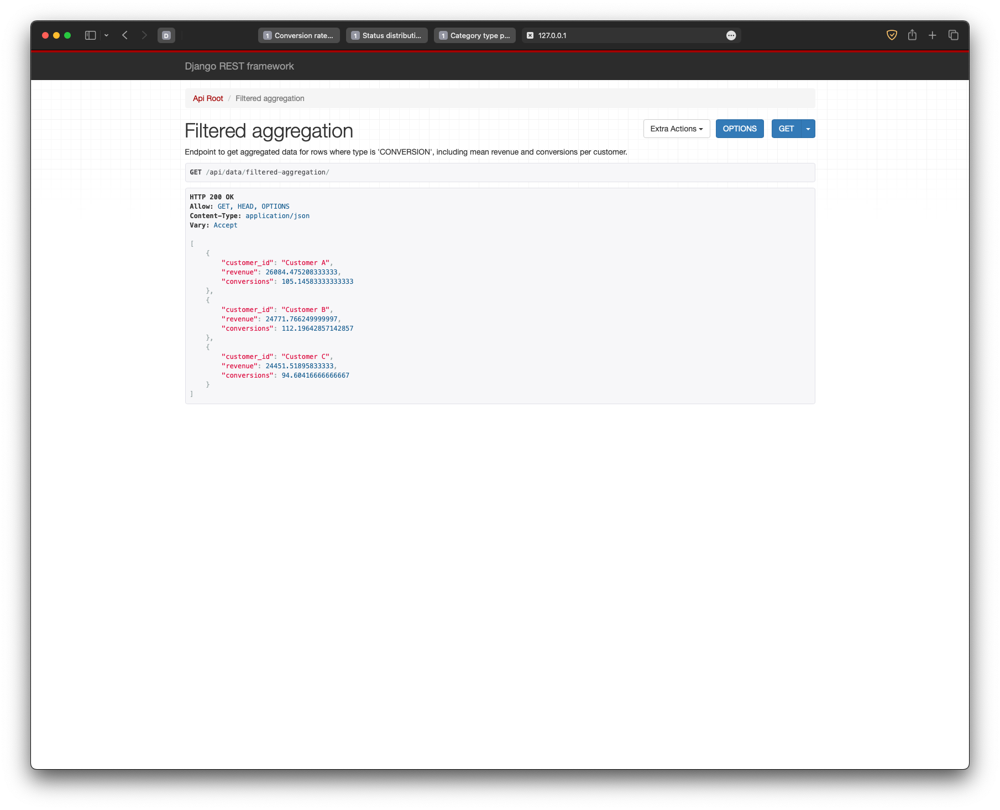

# ORPHEX

# Project Title: Meta Campaign Analysis

## Introduction

This project performs an exploratory analysis on a dataset related to Meta campaigns.
The analysis calculates conversion rates, evaluates status-based distributions,
assesses category and type performance, and aggregates filtered data.

## Prerequisites

- Python 3.x
- Pandas library
- Django
- Django RestFramework

## Setup

1. Clone the repository:

   ```bash
   git clone https://github.com/ybgirgin3/ORPHEX.git
   ```

2. Navigate to the project directory

   ```bash
       cd ORPHEX
   ```

3. Create Python Environment and Install the required dependencies:

   ```bash
   python3 -m venv venv && source venv/bin/activate && pip install -r requirements.txt
   ```

4. Upload CSV Mock Data to DB

   ```bash
   python3 manage.py migrate
   python3 manage.py import_data <csvfilename>.csv
   python3 manage.py makemigrations
   ```

5. Run Server
   ```bash
   python manage.py runserver
   ```

## Screenhosts

- Conversation Rate



- Status Distribution



- Category Type Performance



- Filtered Aggregation


